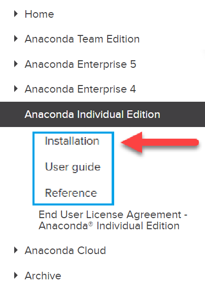
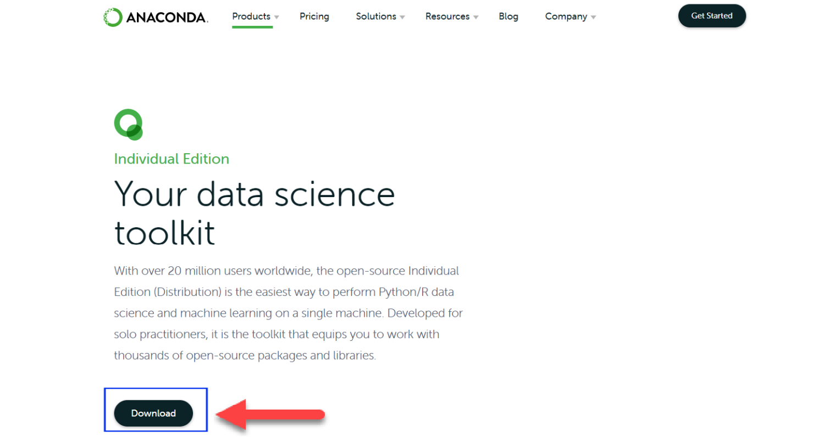
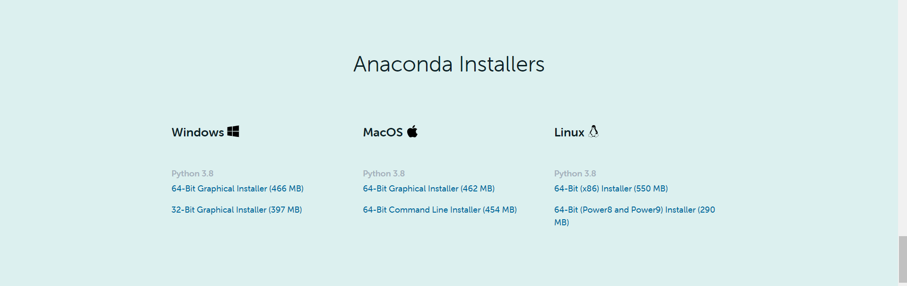
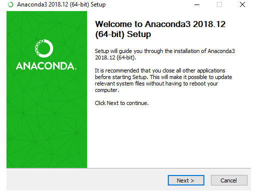
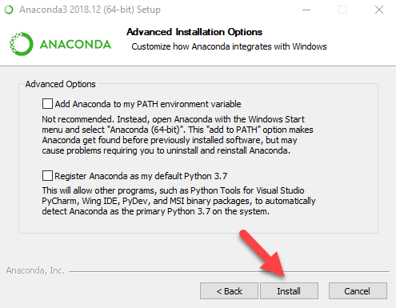
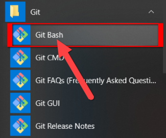
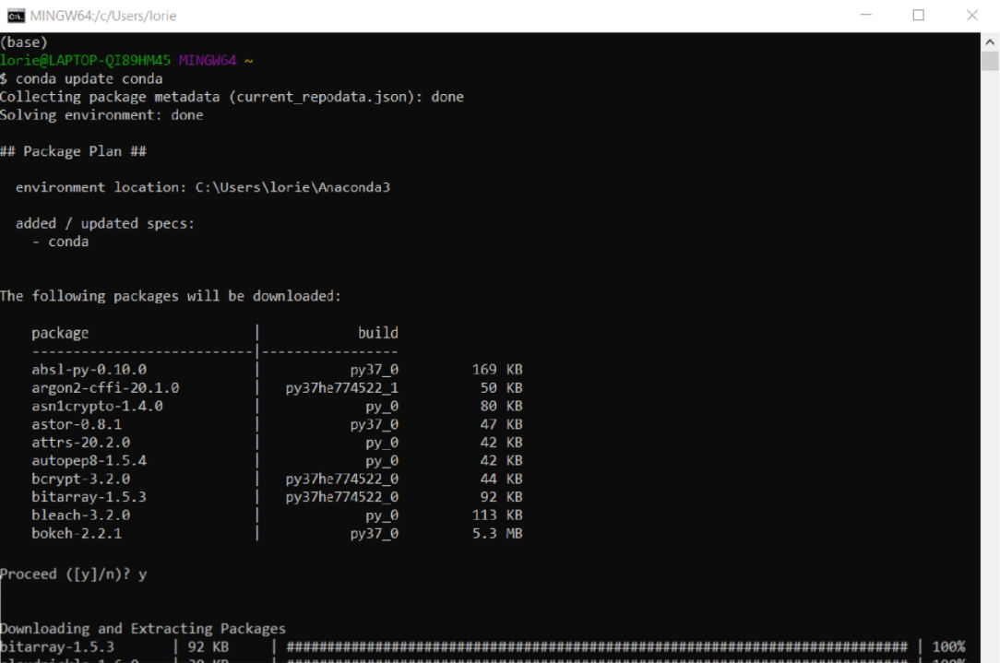
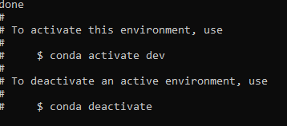
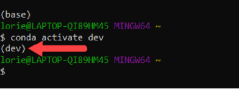

# Curling Up with Python

This guide walks through the installation and configuration process for an Anaconda environment. This guide includes the following:

* Download and installation of Anaconda distribution for Python 3 

* Configuration of Anaconda `dev` virtual environment

* Activation of Anaconda `dev` environment

* **NOTE:** We will be downloading the Python 3.8 distribution by default, however we will create and use a virtual environment that utilizes Python 3.7 instead, to avoid possible package incompatibilities with the new Python 3.8 version.

## Python Virtual Environments

The Python documentation tells us that Python applications will often use packages and modules that are not part of the standard library. Some applications require a specific version of a library if, for example, that version has fixed a bug, or because the application was written using an obsolete version of the library's interface.

This means that it may not be possible for one Python installation to meet the requirements of every application. If Application A needs version 1.0 of a particular module, but Application B needs version 2.0, then the requirements are in conflict, and installing either version 1.0 or 2.0 will leave one application unable to run.

The solution to this problem is to create a virtual environment, a self-contained directory tree that contains a Python installation for a particular version of Python, plus a number of additional packages. Check out Python's tutorial on [Virtual Environments and Packages](https://docs.python.org/3/tutorial/venv.html) for more information.

### Conda

There are multiple ways to create virtual environments, but in this course we will be using Conda. Conda is a package manager application that quickly installs, runs, and updates packages and their dependencies. It allows you to easily set up and switch between environments on your local computer. Conda is included in all versions of Anaconda and Miniconda. Check out the [Conda user guide](https://conda.io/projects/conda/en/latest/user-guide/) for more information.

### Download and Install Anaconda

1. Navigate to the Anaconda installation [documentation](https://docs.anaconda.com/anaconda/install/). It will be valuable to have the documentation available in case any issues arise.

    

2. Navigate to the Anaconda download site, which can be found [here](https://www.anaconda.com/distribution/#windows). Click the `download` button as seen in the below image:

    

3. This will automatically move your screen to to the download section of the page.  Select the appropriate distribution for your system.

    


4. You will be asked to save the installer. Save it. After the download is complete, run the download file. This will launch an installation wizard that will walk you through the Anaconda install. Continue through the installation process by clicking either "I Agree" or "Next."

    

5. You will eventually get to a screen that asks if you would like to set your PATH environment variable using the installation wizard. Do NOT check this box. Make sure that both boxes are unchecked, as displayed in the below screenshot. Click `install`.

    

6. Click Finish once the installation is complete.

7.  Next, open the terminal (Mac) or Git Bash (Windows).
  
    * Mac users can find the terminal by opening their Spotlight Search and typing `Terminal`.

    * Windows users can open Git Bash by locating it in their Start Menu:

    

8. Execute the following commands to ensure the latest Anaconda packages are installed. When prompted, enter "y" to proceed.

    ```shell
    conda update conda
    conda update anaconda
    ```

    

### Create the Virtual Environment

1. The next steps will guide you through creating a virtual environment named `dev`.

2. Run the following command in your terminal or Git Bash. When prompted, enter "y" to proceed.

    ```shell
    conda create -n dev python=3.7 anaconda
    ```

    

3. Activate the `dev` environment.

    ```shell
    conda activate dev
    ```

    

### Final Steps

1. Verify your your installations by executing the `conda list` command after activating the environment, then locating the following packages in the populated list:

    - Numpy
    - Pandas
    - Matplotlib

2. After the installation of Anaconda,  we'll want to enable the terminal commands. The instructions differ by your operating system.

* [Windows](https://codingbootcamp.hosted.panopto.com/Panopto/Pages/Viewer.aspx?id=93a9c967-71b2-434c-bcda-ab7a011f5c9c). After these instructions, you need to open your terminal and run `conda init bash`. Then close your terminal, and start a new one before using any commands.

* [Mac](https://codingbootcamp.hosted.panopto.com/Panopto/Pages/Viewer.aspx?id=1c0d69d6-523c-4275-86a5-ab7a011f370a). Versions of MacOS 10.15 and beyond (Catalina) will need to run `conda init zsh` in the terminal after these steps. Versions below 10.15 will need to run `conda init bash` instead.

3. A few other things to look out for during the post-installation:

* Note that the exact location where your Anaconda folder is installed may differ based upon your operating system, version of operating system, and version of Anaconda. It is not uncommon to need to search for the "anaconda3" directory on your machine.

* If you're having trouble locating the installation directory for Anaconda, try right-clicking the shortcut for anaconda-navigator and going to Properties (Windows) or Get Info (MacOS). The shourtcut should have a reference to the directory containing Anaconda.

## Prework Support

Looking for pre-work support? Our team of tutors are eager to help! Request a tutor session with the following steps:

1. If not already logged in to BCS, login using your credentials ***(supplied 24 hours after enrollment).***
2. Click **Support** in the top right.
3. Complete the form fields to submit your request:
   * Under **Question Category**, select "Tutor Request”
   * Under **Question Category**, select "Request a Tutor”
   * Under **Currently, Which Sessions Would You Like to Discuss?**, select “Prework assignment”. 
4. Complete the additional fields and submit your request. 
