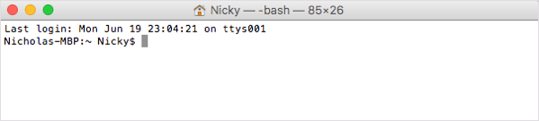

# Get Your Tools Installed (Mac)

Now you'll install the required tools and software for the course. There's a lot to get through, so buckle in and get ready!

## Create Accounts

First, create accounts on the following websites, which you'll use throughout the course. Don't just create logins; recruiters often search these sites for job candidates, so be sure to provide at least a headshot and up-to-date contact information.

- [LinkedIn](https://www.linkedin.com/)

  **Note:** You should create a full profile that highlights your skills and work experience and includes a headshot.

- [GitHub](https://github.com/)

- [Stack Overflow ](http://stackoverflow.com/)

In addition, be sure to accept the invite for your section on [Slack](https://slack.com/). You will receive the link to your class-specific channel during orientation.

## Computer Specifications

The computer you will use in this course needs to meet the following requirements.

- Laptop with at least 8 GB RAM and 64-bit dual processor. Desktop is allowed if your class is online.

   **Note:** Netbooks, thin clients, and tablets are not permitted.

- 64 GB free disk space \(300 GB preferred\)

- At least 2.0 GHz CPU

- Virtualization capable \(Check BIOS settings.\)

- USB port

- Full administrator \("root"\) privileges to operating and all software

### Additional Considerations

- If you are using a work-issued computer, you may not have the permissions required to modify the system in order to complete class activities.

- Students with limited free disk space may elect to purchase a external hard drive to store software and courseware. Note that this is not a substitute for the required 64 GB of free disk space.

**Note:** If you need assistance determining these specifications, see the images below.

### Check CPU and RAM

Click the Apple icon in the top left of your desktop screen. Select **About This Mac** from the drop-down menu. A window like the one below will pop up. Your machine's CPU and RAM will be listed here.

### Check Available Free Space

Click the **Storage** tab along the top of the window.

### Check for Virtualization Capability

Launch Terminal by pressing **Command+spacebar** on your keyboard. Then type **terminal** in the Spotlight Search bar.

Type the command `sysctl -a | grep machdep.cpu.features`. The output is shown below. Look for an entry showing `VMX` \(highlighted below\).

## Tool and Software Installations

Follow these instructions to complete the installation process for all required tools.

### Google Chrome

1. If you don’t already have Chrome installed, visit the download page [here](https://www.google.com/chrome/browser/desktop/index.html).

1. Download, open, and run the installation file.

### Slack

1. Search for Slack in the App Store. Click **Get** under the app name and icon, and then click **Install**.

1. When the installation is complete, add our channel to your application.

1. Click the header of your current Slack channel.

1. Select **Sign in to another team**.

1. Enter the Slack domain provided to you during orientation.

   

1. Enter your email (the one that the Slack invite was sent to) and password.

### Terminal

You’ll be entering your command line code through this interface. Since you’re on a Mac right now, you already have it! Just follow these steps.

1. Press **Command+spacebar** to open Spotlight Search.

1. Type **terminal** into the search and then press **Enter**.

   

1. Keep this window open; you’ll need it for the next steps.

   

### Homebrew

1. Go to [Homebrew](http://brew.sh/).

1. Copy the script listed under Install Homebrew.

   

1. Paste the script into your Terminal window. Press **Enter**.

   

### SSH Keys

It's recommended that you use the following walkthrough video alongside the steps outlined below to add GitHub SSH keys:
​

[SSH Keys Video Walkthrough](https://youtu.be/Nf2Ggt3Mwgk)

To complete these steps, you will need to sign up for a [GitHub](https://github.com/) account if you haven't already.

**Step 1.** Open Terminal.

**Step 2.** To make sure you don’t already have a set of keys on your computer, type the following in your Terminal window. **Note:** Copying and pasting will not work!

   ​								`ls –al ~/.ssh`

   - If no keys pop up, move on to Step 3.
   - If keys do pop up, check that none of them are listed under `id_rsa`, like in this image:

   

   * If you find a key with a matching name, you can either overwrite it by following the next steps, or you can use the same key referenced in Step 8. If you decide not to overwrite it, you will need to remember the password tied to your key.  

**Step 3.** Enter the following command along with your email to generate your keys. 

   `ssh-keygen –t rsa –b 4096 –C "YOURGITHUBEMAIL@PLACEHOLDER.NET"`

**Step 4.** When prompted to enter a file to save the key, press **Enter**, and then enter a passphrase for your key. **Note:** You shouldn’t see any characters appear in the window while typing the password. When you’re finished, your window should look like this:

   

**Step 5.** Link your key to your machine using a tool called the ssh-agent. Run the following command to test whether the ssh-agent is running on your machine: `eval "$(ssh-agent –s)"`. Your Terminal window should look like this:

   

**Step 6.** Run the following command: `ssh-add ~/.ssh/id_rsa`.

**Step 7.** When prompted, enter the passphrase associated with the key. **Note:** If you’ve forgotten this key, go back to Step 3. 

**Step 8.** To add the key to GitHub, copy the key to your clipboard by entering the following command:

   `pbcopy < ~/.ssh/id_rsa.pub`

 - You shouldn’t see any kind of message when you run this command. If you do, make sure you entered it correctly. 

- **Note:** Do not copy anything else to your clipboard until all steps are completed. Otherwise, you’ll need to enter the copy command again.

**Step 9.** Go to GitHub's [SSH key settings](https://github.com/settings/ssh). Click **New SSH key**.

**Step 10.** When the form pops up, enter a name for your computer in the Title input. In the Key input, paste the SSH key you copied in Step 8.

**Step 11.** To add GitHub to your computer’s list of acceptable SSH hosts, type the following command in your Terminal window:  `ssh –T git@github.com`.

   * You should see an RSA fingerprint in your window. Enter **yes** only if it matches the one highlighted in the image below: 

      

### VS Code

1. Go to the [setup page](https://code.visualstudio.com/docs/setup/setup-overview) on the VS Code website and select Mac as your platform.

1. Open your Downloads folder and click on the file to unzip.

1. Drag the file to your Applications folder.

## You're Done!

That's all for the installations, so give yourself a pat on the back! Installations are never fun, but just like taxes, you gotta do them.

Be sure to take a break before continuing with the rest of the prework.

## Prework Support

Looking for pre-work support? Our team of tutors are eager to help! Request a tutor session with the following steps:

1. If not already logged in to BCS, login using your credentials ***(supplied 24 hours after enrollment).***
2. Click **Support** in the top right.
3. Complete the form fields to submit your request:
   * Under **Question Category**, select "Tutor Request”
   * Under **Question Category**, select "Request a Tutor”
   * Under **Currently, Which Sessions Would You Like to Discuss?**, select “Prework assignment”. 
4. Complete the additional fields and submit your request. 