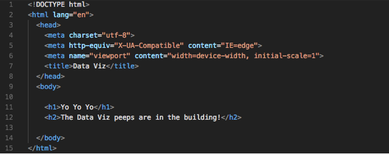

# Module 2: Install Your Tools

This course will expose you to a wide range of tools, some (or all) of which you may be unfamiliar with. Although they may be overwhelming at first, these tools will soon become as familiar to you as a scalpel is to a surgeon. The purpose of this section is to acquaint you with each of these tools before walking you through the process of installing them on your machine.

Below is a list of the tools you should install before your first class to ensure you're ready to dive in on Day 1.

- Google Chrome
- Slack
- Git and GitHub
- Git Bash \(Windows only\)
- Terminal \(Mac only; preinstalled)
- Homebrew (Mac only)
- SSH Keys
- Python and Anaconda
- VS Code

You should also create accounts on the following websites:

- LinkedIn
- GitHub
- Stack Overflow

If you encounter any issues during setup, don't worry. Your instructional staff will help you troubleshoot any errors and answer your questions on the first day of class. Just sit tight until then.

---

## An Overview of Your Tools

Before installing your tools, take a moment to examine each of them in more detail to better understand the role they will play in the course.

### Google Chrome

This is the web browser we'll be using to quickly determine whether our code is working. Google Chrome has a number of tools that make it an ideal platform to use in this course, so if you are currently using a different browser, we encourage you to switch to Chrome.

### Slack

Slack is an online communication tool that is a forum, instant messenger, and email all rolled into one. Slack is used by countless organizations worldwide, and you'll be using it every single day for the next six months.

We will use Slack to send code snippets during class, relay important announcements, and facilitate group activities. You will receive the link to your class-specific channel during orientation. Although there is a Slack web client, for this course you should have the program installed on your machine.

### Git and GitHub

Code files are largely collaborative, as developers are constantly building on each other's work. Git is a version-control system that offers a specialized set of strategies for orchestrating this collaboration, and GitHub stores these collaborative actions online. You can think of GitHub as a sort of Dropbox for coders. It offers a central place for developers to upload their code, view revision history, and make changes to a master set of files. You'll learn a lot about Git and GitHub during your first week of class. You will receive the link to your class-specific repository during orientation.

Follow these instructions to [set your Git username for every repository on your computer](https://help.github.com/articles/setting-your-username-in-git/) and [set your email address for every repository on your computer](https://help.github.com/articles/setting-your-commit-email-address-in-git/).

### Git Bash and Terminal

Git Bash (for Windows users) and Terminal (for Mac users) offer a command-line interface for working with the files and folders on your computer.

_So, is it like Finder or Windows Explorer?_ Kind of, except there are no pictures or visuals. It's just a box with text.

_Uh, why would I want that?_ Over time, you'll come to understand that, in many situations, using the command line can be faster and more effective than relying on the operating system's graphical user interface (GUI). You'll get plenty of exposure to the command line at the beginning of the course.

### Homebrew \(Mac Only\)

Homebrew is a Mac-specific tool kit that makes it easy to install a variety of applications using the command line. It can greatly simplify the installation process for various tools you'll be using throughout your career.

### SSH Keys

Generating SSH keys allows developers to interface with certain remote services without having to constantly enter login information. You will set up an SSH key for GitHub.

Without a key, you won’t be able to push your code to GitHub without entering a password each time. And trust us, this would be as irritating as needing a key to open every door in your home.

### Python and Anaconda

Python and its ecosystem are extremely popular tools in the FinTech world. This course will use a popular all-in-one solution called Anaconda, which contains everything we'll need for the Python units of the course.

### VS Code

Oh, the power of VS Code! A little program that does so much!

Visual Studio (VS) Code is a free text editor that runs on Mac, Linux, and Windows operating systems. For developers, text editors are like cozy pillows on which they rest their heads.

At a fundamental level, programming is all about creating text in files with various extensions. When we create a block of HTML like the one below, what we've really done is create a block of text. There are some funny symbols in there, but at its most basic level, it's just text.

For a simple text editor, this is where the comprehension stops: our block of HTML remains a block of text. But for more powerful text editors like VS Code, these blocks of text are immediately recognized as code (as long as we include the right file extension). VS Code can provide a more visually intuitive understanding of the code through indicative coloring, smart tabs, and autocomplete functionality. As a result, creating HTML is a more natural process, and the HTML can be debugged more quickly.

## You're Ready to Install!

Now it's time to begin the installation process. Setup guides for both Mac and Windows users are provided in the links below. Follow the instructions closely and do your best with the information you have. (Yes, we know there is a lot to install.)

- [Get Your Tools Installed (Mac)](get-yo-tools-installed-on-mac.md)
- [Get Your Tools Installed (Windows)](get-yo-tools-installed-on-windows.md)
- [Curling Up With Python](curling-up-with-python.md)

One bit of advice: Throughout the course, you will frequently need to install and use unfamiliar tools. Resist the urge to stop and ask, "Am I doing this right?" Instead, trust your instincts and take your best stab at it. If you get lost, we'll get you the help you need right away. You can do this!

## Prework Support

Looking for pre-work support? Our team of tutors are eager to help! Request a tutor session with the following steps:

1. If not already logged in to BCS, login using your credentials ***(supplied 24 hours after enrollment).***
2. Click **Support** in the top right.
3. Complete the form fields to submit your request:
   * Under **Question Category**, select "Tutor Request”
   * Under **Question Category**, select "Request a Tutor”
   * Under **Currently, Which Sessions Would You Like to Discuss?**, select “Prework assignment”. 
4. Complete the additional fields and submit your request. 