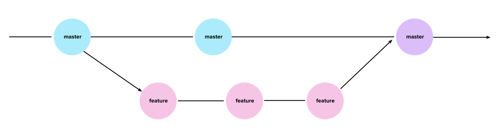

# Module 6: What Is Git/GitHub?

This won't be the type of classroom where you sit and listen to lectures all day; you'll be learning in new and exciting ways. In this prework, we may employ some learning techniques that are foreign to you, but trust us that these are proven educational strategies that will transform the way you learn forever.

In this section, we're going to use a tool that we call "1 in 3", that is, we'll explain one concept in three ways. Each explanation will be progressively more technical. This is a great way to get a broad understanding of a new field or concept. The purpose of this section is to develop a deeper understanding of how to use Git for version control.

_**Why spend time on this?**_ 

We need our students to understand the basics of Git and how it works in order to work collaboratively with colleagues and communicate effectively across technical teams at their organizations. This is a high-level overview aimed at introducing common vocabulary and concepts relevant to the technology.

## Part 1: Basic Explanation

Git and GitHub are tools that help developers collaborate and safely store their code. 

People need a place to safely store their code. Imagine that you kept all your projects on your computer, and then your computer was stolen. You could lose months of work. Just like Dropbox is used to back up documents, GitHub is an online space used to store code. GitHub also allows you to share code with others and work with teams on projects. 

Git is a software application that runs on your machine and allows you to add code files to and download files from GitHub.

---

## Part 2: Foundational Knowledge

**_What is Git?_**

Git is a version-control software that runs on your computer and serves two primary purposes:

1. It tracks changes to any files in your project. If you have a working application and you accidentally break it, you can roll it back to a previous point. Unlike Microsoft Word or similar programs, not only can you go back to the previously saved point, but you can go back to any point in time that you saved. 

2. It allows you to add (push) and download (pull) code from your repository in GitHub. This functionality is similar to the Dropbox client that syncs your local files with Dropbox. 

#### Real-World Example:

Imagine you're playing a video game and there's a key you can press to save at any time you want. Perhaps you saved twice in Level 1, once in Level 2, and once in Level 3. The game is going well, but suddenly it takes a turn for the worst. Your health is waning, your energy is low, and you're down to your last life. Not to worry; you can go back to any of your save points!

The save point from Level 3 seems like the obvious choice because you were the furthest along in the game at that point. You pop back to the Level 3 saved version, and _bam_! Your game is right where you left it in Level 3. Your health is great, your energy is high, and you have lives to spare. Life is good.

But before long, you end up back in the same predicament; it seems like the bad decisions actually occurred long before Level 3. So you pop back to your second saved version on Level 1 and whiz through the game with ease. 

This video game example is a scenario that happens in software development frequently. Suppose you are building an event management software for a local event planner. They ask you to add a calendar widget so clients can see available dates. You're working on this for a few days and it's going great, but then you code yourself into a corner and break the entire application trying to figure it out. If you used Git and saved (pushed) frequently enough, you can roll back to the exact point where you took a wrong turn. 

**_What is GitHub?_**

GitHub is a web-based storage solution for developers. It's like the developer's Dropbox or Google Drive. You can store code for safekeeping and share it with others. But it's also much more than that: it's a version-control system.

Suppose you are managing a team of five developers who are all working on a project. Quality is dropping, and more bugs are slipping into production. You find the offending files. 

_Want to know who wrote them?_

 GitHub can tell you that. 

_Want to know who reviewed them and said they were okay?_

GitHub has that info too. 

_How about rolling back to a previous version when things were more stable?_

Easy peasy. 

GitHub also helps developers collaborate. Let's take a look at the following example.

#### Real-World Example:

Janet and Tasha are working together on a login feature. The design files call for two shades of green and a shade of yellow to be used on the site. Janet is working on the login box and adds a green background. Tasha is working on the same feature and adds a purple background. They aren't using GitHub. Janet uploads her files first, followed closely by Tasha. What color is the background? It's purple. This is definitely not right, but whoever pushes last wins in the wild world of the GitHub-less. 

Now let's take a look at the same scenario with GitHub:

Janet pushes her code and it's merged into the production code. Tasha pushes her code, but GitHub blocks it from being merged. There's a conflict! Someone on the team has to review the code, check the conflict, and choose which code is correct. Their teammate Alysha reviews the code, notices that the purple doesn't match the design files, and tells GitHub to use the green background before merging the rest of Tasha's code. 

Tada! Cloud storage, version control, and source code management all in one!

---

## Part 3: Technical Explanation

**_What is Git?_**

Git is the most widely used version-control system. Version control is software that helps a team manage changes to its source code. Git was created in 2005 to manage the Linux kernel. Today it is used across the world for an unfathomably huge number of software projects.

Git tracks your changes to the source code via **commits** and syncs with a remote source, like GitHub or Bitbucket, via **push** (to send your commits to the remote) or **pull** (to retrieve commits from the remote) commands.

**_What is GitHub?_**

GitHub is an online space to work collaboratively on projects and keep your code safe.

Most software requires teams of developers to work simultaneously in a careful way. GitHub is a powerful tool that allows us to do that, which is one of the reasons developers rely on it so heavily. Virtually every software company stores its code in GitHub or a similar service.

**_How do I use Git and GitHub?_**

[This handy video](https://www.youtube.com/watch?v=seICQOd2qsY) walks you through the following steps. 

1. Create a new repository.

1. Copy the link.

1. In the terminal, `cd` into the directory where you want your repo to live. 

1. Clone the repo: `git clone <repo name>` 

1. `cd` into the repo.

1. Add a file.

1. Stage the changes in your current working directory: `git add .` 

1. Commit the changes: `git commit -m "some message"`

1. Push the changes: `git push origin main`

This will push your changes directly to the master branch. The **main** is the default branch of your repository and, as its name suggests, is the master source for your project. As you might have guessed, we do not want to push directly to our master branch. In fact, when working on a team, you likely will not have access to do so.

To get around this, we use a workflow called **feature branching**. The main idea behind feature branching is that all feature development should take place in a dedicated branch rather than pushing directly to the master branch. 

Here's how you can work in this kind of environment:

* Create a new branch. 

* All changes to the repository (additions, modifications, and deletions) are made in this branch. 

* Commit the changes and push them to the remote source (GitHub). 

* Once the branch has been pushed to the remote, open a **pull request**. 

* When the pull request has been made, automated tests are often run to ensure the modifications do not break the working application. 

* Pull requests also initiate a discussion about the changes you've committed, which generally must be approved by someone else on the team. That person (or entire team) will review your changes to make sure that everything is in order. 

* Once any concerns have been addressed and the pull request has been approved, the modified code is merged into the master branch. 

A great benefit of this process is that, once merged, pull requests act as a record of changes to the codebase.

To create a new branch:

1. `cd` into the repo directory.

1. Create and switch to a new branch: `git checkout -b new-branch-name` 

1. Make the changes to your repository.

1. Stage the changes: `git add -A`

1. Commit the changes: `git commit -m "some message"`

1. Push the changes: `git push origin new-branch-name`

1. Navigate to your GitHub repository in your browser.

1. Click the **Pull Requests** tab to create a new pull request.

To switch between existing branches, use `git checkout branch-name`. Note that you do not need the `-b` flag in your `git checkout` command this time because you are not creating a new branch.

To merge your changes into master and update your local repository with those changes:

1. In GitHub, merge the pull request you created.

1. On your computer, switch back to your master branch: `git checkout master`

1. Pull the updates from the remote server: `git pull`

## Prework Support

Looking for pre-work support? Our team of tutors are eager to help! Request a tutor session with the following steps:

1. If not already logged in to BCS, login using your credentials ***(supplied 24 hours after enrollment).***
2. Click **Support** in the top right.
3. Complete the form fields to submit your request:
   * Under **Question Category**, select "Tutor Request”
   * Under **Question Category**, select "Request a Tutor”
   * Under **Currently, Which Sessions Would You Like to Discuss?**, select “Prework assignment”. 
4. Complete the additional fields and submit your request. 